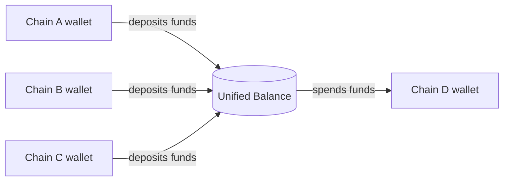
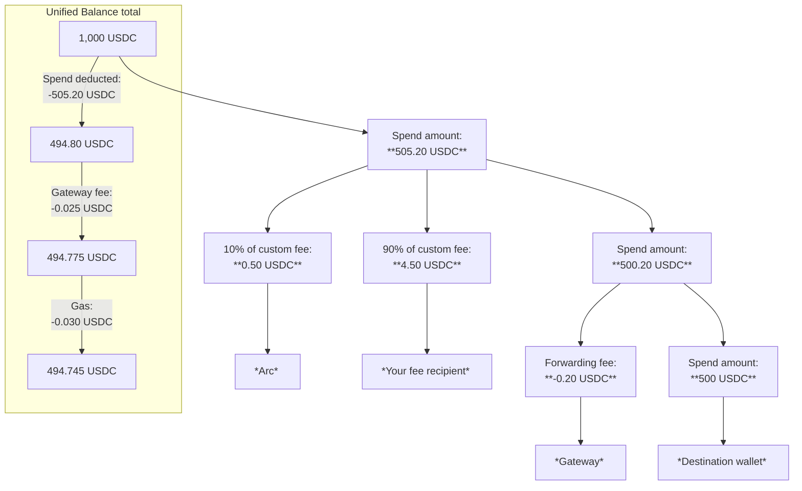

> ## Documentation Index
> Fetch the complete documentation index at: https://docs.arc.network/llms.txt
> Use this file to discover all available pages before exploring further.

# App Kit: Unified Balance

> Create a chain-agnostic USDC balance and spend it instantly on any blockchain with App Kit's Unified Balance capability.

App Kit's Unified Balance capability combines USDC from multiple blockchains
into a single, instantly spendable balance. It is built on top of
[Circle Gateway](https://developers.circle.com/gateway) and abstracts the
Gateway workflow so that cross-ecosystem spends (for example, EVM → non-EVM) are
as straightforward as same-ecosystem spends (for example, EVM chain → another
EVM chain).

## How it works

Unified Balance works by depositing funds held across multiple blockchains into
a single, chain-agnostic Unified Balance. Those funds are then available to
spend instantly on any blockchain.

The process is illustrated below:



## Quick look

This code snippet creates a Unified Balance by depositing funds from two
blockchains to spend on a third:

```typescript TypeScript theme={null}
// Deposit 1.00 USDC into the Unified Balance from Base
const depositBase = await kit.unifiedBalance.deposit({
  from: { adapter: viemAdapter, chain: "Base_Sepolia" },
  amount: "1.00",
  token: "USDC",
});
// Deposit 1.00 USDC into the Unified Balance from Arbitrum
const depositArb = await kit.unifiedBalance.deposit({
  from: { adapter: viemAdapter, chain: "Arbitrum_Sepolia" },
  amount: "1.00",
  token: "USDC",
});
// Spend 1.50 USDC from the Unified Balance on Arc
const spendResult = await kit.unifiedBalance.spend({
  amount: "1.50",
  from: { adapter: viemAdapter },
  to: {
    adapter: viemAdapter,
    chain: "Arc_Testnet",
    recipientAddress: "0xRecipientAddress",
  },
});
```

For a complete end-to-end flow, follow the quickstart for your scenario:

* [Deposit and Spend a Unified Balance](/app-kit/quickstarts/unified-balance-deposit-and-spend)
* [Use a Delegate to Deposit and Spend a Unified Balance](/app-kit/quickstarts/unified-balance-delegate-deposit-and-spend)

## Installation

App Kit comes with the Unified Balance capability installed by default. If
you've already installed App Kit, you can skip this section. If you only need to
use the Unified Balance capability and don't want the full App Kit, you can
install the standalone package.

Install the Unified Balance package and the adapters that match your
environment:

<Steps>
  <Step title="Install the Unified Balance package">
    <CodeGroup>
      ```bash npm theme={null}
      npm install @circle-fin/unified-balance-kit
      ```

      ```bash yarn theme={null}
      yarn add @circle-fin/unified-balance-kit
      ```
    </CodeGroup>
  </Step>

  <Step title="Install adapters">
    Install the [adapters](/app-kit/tutorials/adapter-setups) you need for the
    blockchains you plan to deposit from and spend on.

    <Tabs>
      <Tab title="Viem">
        <CodeGroup>
          ```bash npm theme={null}
          npm install @circle-fin/adapter-viem-v2 viem
          ```

          ```bash yarn theme={null}
          yarn add @circle-fin/adapter-viem-v2 viem
          ```
        </CodeGroup>
      </Tab>

      <Tab title="Ethers">
        <CodeGroup>
          ```bash npm theme={null}
          npm install @circle-fin/adapter-ethers-v6 ethers
          ```

          ```bash yarn theme={null}
          yarn add @circle-fin/adapter-ethers-v6 ethers
          ```
        </CodeGroup>
      </Tab>

      <Tab title="Solana">
        <CodeGroup>
          ```bash npm theme={null}
          npm install @circle-fin/adapter-solana-kit @solana/kit @solana/web3.js
          ```

          ```bash yarn theme={null}
          yarn add @circle-fin/adapter-solana-kit @solana/kit @solana/web3.js
          ```
        </CodeGroup>
      </Tab>

      <Tab title="Circle Wallets">
        <CodeGroup>
          ```bash npm theme={null}
          npm install @circle-fin/adapter-circle-wallets
          ```

          ```bash yarn theme={null}
          yarn add @circle-fin/adapter-circle-wallets
          ```
        </CodeGroup>
      </Tab>
    </Tabs>
  </Step>
</Steps>

> ## Documentation Index
> Fetch the complete documentation index at: https://docs.arc.network/llms.txt
> Use this file to discover all available pages before exploring further.

# Quickstart: Deposit and spend a Unified Balance

> Deposit USDC from an EVM chain and Solana into a Unified Balance, then spend from the combined pool on another blockchain

Use App Kit to deposit into a Unified Balance and spend from it. In this
quickstart, you'll write scripts that deposit from Base Sepolia and Solana
Devnet, check your balance, and spend on Arc Testnet.

These are examples only. You can use any of the
[supported blockchains](/app-kit/references/supported-blockchains) and fund the
Unified Balance from as many sources as you need. The scripts use built-in
public RPC URLs, which may be rate-limited or unreliable. For a more stable
connection, you can
[configure a custom RPC](/app-kit/tutorials/adapter-setups#custom-rpc).

## Prerequisites

Before you begin, ensure that you've:

* Installed [Node.js v22+](https://nodejs.org/).
* Created an EVM wallet using a wallet provider such as
  [MetaMask](https://metamask.io/) and added the
  [Base Sepolia](https://docs.base.org/docs/network-information#base-testnet-sepolia)
  and
  [Arc Testnet](https://docs.arc.network/arc/references/connect-to-arc#wallet-setup)
  networks.
* Created a Solana wallet (for example, [Phantom](https://phantom.app/) or
  [Solflare](https://solflare.com/)) on Devnet.
* Funded your wallets with testnet tokens:
  * Get testnet USDC from the [Circle Faucet](https://faucet.circle.com/) on
    Base Sepolia and Solana Devnet.
  * Get testnet ETH on Base Sepolia from a
    [public faucet](https://www.alchemy.com/faucets/base-sepolia) (needed for
    deposit and spend transactions on Base Sepolia).
  * Get SOL for Solana Devnet from the
    [Solana Faucet](https://faucet.solana.com/).
  * Fund the recipient wallet on Arc Testnet if needed (USDC on Arc can cover
    gas for the destination credit when you spend on Arc).
* Obtained an Arc Testnet address that will receive USDC when you spend on Arc
  Testnet.

## Step 1. Set up your project

### 1.1. Create the project and install dependencies

Create a new directory and install App Kit and its dependencies:

```bash Shell theme={null}
mkdir unified-balance-multichain
cd unified-balance-multichain
npm init -y
npm pkg set type=module

npm install @circle-fin/app-kit @circle-fin/adapter-viem-v2 @circle-fin/adapter-solana viem @solana/web3.js
npm install --save-dev typescript tsx @types/node
```

<Tip>
  Only need a Unified Balance and want a lighter install than the full App Kit?
  Install the standalone package instead: `@circle-fin/unified-balance-kit`
</Tip>

### 1.2. Configure TypeScript (optional)

<Info>
  This step is optional. It helps prevent missing types in your IDE or editor.
</Info>

Create a `tsconfig.json` file:

```bash Shell theme={null}
npx tsc --init
```

Then, update the `tsconfig.json` file:

```bash Shell theme={null}
cat <<'EOF' > tsconfig.json
{
  "compilerOptions": {
    "target": "ESNext",
    "module": "ESNext",
    "moduleResolution": "bundler",
    "strict": true,
    "types": ["node"]
  }
}
EOF
```

### 1.3. Set environment variables

Create a `.env` file in the project directory:

```text .env theme={null}
EVM_PRIVATE_KEY=0xYOUR_EVM_PRIVATE_KEY
SOLANA_PRIVATE_KEY=YOUR_SOLANA_PRIVATE_KEY
EVM_RECIPIENT_ADDRESS=0xYOUR_RECIPIENT_ADDRESS
```

* Replace `0xYOUR_EVM_PRIVATE_KEY` with the private key for the wallet that
  holds USDC on Base Sepolia.
* Replace `YOUR_SOLANA_PRIVATE_KEY` with the base58 private key for the wallet
  that holds USDC on Solana Devnet.
* Replace `0xYOUR_RECIPIENT_ADDRESS` with the address that should receive USDC
  on Arc Testnet when you spend.

<Info>
  If you use MetaMask, follow their guide for how to [find and export your
  private
  key](https://support.metamask.io/configure/accounts/how-to-export-an-accounts-private-key/).
</Info>

<Tip>
  Edit `.env` files in your IDE or editor so credentials are not leaked to your
  shell history.
</Tip>

## Step 2. Deposit into a Unified Balance

In this step, you'll deposit from Base Sepolia and Solana Devnet using two small
scripts. Each script handles one source blockchain only.

### 2.1. Create the deposit scripts

<Tip>
  You can combine both deposits in a single script if you prefer. One `main`
  function can create both adapters and call `kit.unifiedBalance.deposit` once per
  blockchain (await each call in sequence). This example uses two files to keep
  each deposit easy to run and verify on its own.
</Tip>

<Steps>
  <Step title="Create Base Sepolia deposit script">
    Create `deposit-base.ts`. This script deposits 2.00 USDC from your Base Sepolia
    wallet into your Unified Balance:

    ```typescript deposit-base.ts theme={null}
    import { AppKit } from "@circle-fin/app-kit";
    import { inspect } from "node:util";
    import { createViemAdapterFromPrivateKey } from "@circle-fin/adapter-viem-v2";

    const DEPOSIT_AMOUNT = "2.00";

    const kit = new AppKit();

    const adapter = createViemAdapterFromPrivateKey({
      privateKey: process.env.EVM_PRIVATE_KEY as `0x${string}`,
    });

    async function main() {
      const result = await kit.unifiedBalance.deposit({
        from: { adapter, chain: "Base_Sepolia" },
        amount: DEPOSIT_AMOUNT,
        token: "USDC",
      });

      console.log("Result:", inspect(result, false, null, true));
    }

    void main();
    ```
  </Step>

  <Step title="Create Solana Devnet deposit script">
    Create `deposit-solana.ts`. This script deposits 1.00 USDC from your Solana
    Devnet wallet into your Unified Balance:

    ```typescript deposit-solana.ts theme={null}
    import { AppKit } from "@circle-fin/app-kit";
    import { inspect } from "node:util";
    import { createSolanaAdapterFromPrivateKey } from "@circle-fin/adapter-solana";

    const DEPOSIT_AMOUNT = "1.00";

    const kit = new AppKit();

    const adapter = createSolanaAdapterFromPrivateKey({
      privateKey: process.env.SOLANA_PRIVATE_KEY as string,
    });

    async function main() {
      const result = await kit.unifiedBalance.deposit({
        from: { adapter, chain: "Solana_Devnet" },
        amount: DEPOSIT_AMOUNT,
        token: "USDC",
      });

      console.log("Result:", inspect(result, false, null, true));
    }

    void main();
    ```
  </Step>
</Steps>

### 2.2. Run the deposit scripts

<Steps>
  <Step title="Run the Base Sepolia deposit script">
    In your terminal, run:

    ```bash Shell theme={null}
    npx tsx --env-file=.env deposit-base.ts
    ```

    You'll see output like:

    ```bash Shell theme={null}
    Result:
    {
      amount: '2.00',
      token: 'USDC',
      chain: 'Base_Sepolia',
      txHash: '0x...',
      explorerUrl: 'https://sepolia.basescan.org/tx/0x...',
      ...
    }
    ```
  </Step>

  <Step title="Run the Solana Devnet deposit script">
    In your terminal, run:

    ```bash Shell theme={null}
    npx tsx --env-file=.env deposit-solana.ts
    ```

    You'll see output like:

    ```bash Shell theme={null}
    Result:
    {
      amount: '1.00',
      token: 'USDC',
      chain: 'Solana_Devnet',
      txHash: '2k41...',
      explorerUrl: 'https://solscan.io/tx/2k41...?cluster=devnet',
      ...
    }
    ```
  </Step>
</Steps>

### 2.3. Verify the deposits

Open the `explorerUrl` from each deposit result and confirm the onchain
transactions on Base Sepolia and Solana Devnet. When both deposits are
finalized, continue to the next step.

## Step 3. Check your Unified Balance

In this step, you query your Unified Balance across the Base Sepolia and Solana
Devnet depositors and print the confirmed and pending amounts.

### 3.1. Create the balance check script

Create a `check-balance.ts` file:

```typescript check-balance.ts theme={null}
import { AppKit } from "@circle-fin/app-kit";
import { inspect } from "node:util";
import { createViemAdapterFromPrivateKey } from "@circle-fin/adapter-viem-v2";
import { createSolanaAdapterFromPrivateKey } from "@circle-fin/adapter-solana";

const kit = new AppKit();

const evmAdapter = createViemAdapterFromPrivateKey({
  privateKey: process.env.EVM_PRIVATE_KEY as `0x${string}`,
});

const solanaAdapter = createSolanaAdapterFromPrivateKey({
  privateKey: process.env.SOLANA_PRIVATE_KEY as string,
});

async function main() {
  const balances = await kit.unifiedBalance.getBalances({
    // Both wallets that deposited, one adapter per source
    sources: [{ adapter: evmAdapter }, { adapter: solanaAdapter }],
    networkType: "testnet",
    includePending: true,
  });

  console.log("Result:", inspect(balances, false, null, true));
}

void main();
```

### 3.2. Run the balance check script

In your terminal, run:

```bash Shell theme={null}
npx tsx --env-file=.env check-balance.ts
```

You'll see output like:

```bash Shell theme={null}
Result:
{
  token: 'USDC',
  totalConfirmedBalance: '3.00',
  totalPendingBalance: '0.00',
  breakdown: [
    {
      depositor: '0x...',
      totalConfirmed: '2.00',
      totalPending: '0.00',
      breakdown: [{ chain: 'Base_Sepolia', confirmedBalance: '2.00', ... }]
    },
    {
      depositor: '...',
      totalConfirmed: '1.00',
      totalPending: '0.00',
      breakdown: [{ chain: 'Solana_Devnet', confirmedBalance: '1.00', ... }]
    }
  ]
}
```

After a deposit, funds can appear in `totalPendingBalance` before they are
reflected in `totalConfirmedBalance`. Wait until the confirmed balance is
sufficient before you spend.

## Step 4. Spend from the combined balance

In this step, you spend USDC on Arc Testnet from your Unified Balance.

### 4.1. Create the spend script

Create a `spend.ts` file. This script spends 2.50 USDC on Arc Testnet for the
recipient.
[App Kit chooses](/app-kit/tutorials/unified-balance/select-source-blockchains)
how much USDC to use from each blockchain.

```typescript spend.ts theme={null}
import { AppKit } from "@circle-fin/app-kit";
import { inspect } from "node:util";
import { createViemAdapterFromPrivateKey } from "@circle-fin/adapter-viem-v2";
import { createSolanaAdapterFromPrivateKey } from "@circle-fin/adapter-solana";

const SPEND_AMOUNT = "2.50";

const kit = new AppKit();

const evmAdapter = createViemAdapterFromPrivateKey({
  privateKey: process.env.EVM_PRIVATE_KEY as `0x${string}`,
});

const solanaAdapter = createSolanaAdapterFromPrivateKey({
  privateKey: process.env.SOLANA_PRIVATE_KEY as string,
});

async function main() {
  const recipientAddress = process.env.EVM_RECIPIENT_ADDRESS as string;

  console.log(
    `Spending ${SPEND_AMOUNT} USDC on Arc_Testnet for ${recipientAddress}...\n`,
  );

  const result = await kit.unifiedBalance.spend({
    amount: SPEND_AMOUNT,
    token: "USDC",
    from: [{ adapter: evmAdapter }, { adapter: solanaAdapter }],
    to: {
      adapter: evmAdapter,
      chain: "Arc_Testnet",
      recipientAddress,
    },
  });

  console.log("Result:", inspect(result, false, null, true));
}

void main();
```

<Tip>
  You can customize your Unified Balance to
  [collect a custom fee](/app-kit/tutorials/unified-balance/collect-custom-spend-fees)
  from end users,
  [estimate fees](/app-kit/tutorials/unified-balance/estimate-spend-fees) before
  spending,
  [select source blockchains and allocations](/app-kit/tutorials/unified-balance/select-source-blockchains)
  to fund a balance, or use the
  [Forwarding Service](/app-kit/tutorials/unified-balance/use-forwarding-service).
</Tip>

### 4.2. Run the spend script

In your terminal, run:

```bash Shell theme={null}
npx tsx --env-file=.env spend.ts
```

When the script completes, you should see output similar to:

```bash Shell theme={null}
Spending 2.50 USDC on Arc_Testnet for 0x...

Result:
{ recipientAddress: '0x...', destinationChain: 'Arc Testnet', txHash: '0x...', ... }
```

### 4.3. Verify the spend

Use the `explorerUrl` from the spend result to confirm that USDC arrived at the
recipient address on Arc Testnet. The received amount can be less than the
requested spend after fees. For more on fees, see
[How Unified Balance fees work](/app-kit/concepts/unified-balance-fees).

> ## Documentation Index
> Fetch the complete documentation index at: https://docs.arc.network/llms.txt
> Use this file to discover all available pages before exploring further.

# Quickstart: Use a delegate to deposit and spend a Unified Balance

> Let a backend delegate wallet fund and spend a user's Unified Balance while the user keeps ownership

A delegate wallet can deposit into a user's Unified Balance and spend from it
after the user gives authorization.

In this quickstart, you'll need two wallets: a user wallet that owns the Unified
Balance and a delegate wallet that deposits funds and signs spends on the user's
behalf. You'll write scripts that deposit from Base Sepolia, authorize the
delegate on Base Sepolia, check the user's Unified Balance, and spend on Arc
Testnet.

These are examples only. You can use any of the
[supported blockchains](/app-kit/references/supported-blockchains) and fund the
Unified Balance from as many sources as you need. The scripts use built-in
public RPC URLs, which may be rate-limited or unreliable. For a more stable
connection, you can
[configure a custom RPC](/app-kit/tutorials/adapter-setups#custom-rpc).

## Prerequisites

Before you begin, ensure that you've:

* Installed [Node.js v22+](https://nodejs.org/).
* Created two EVM wallets (delegate and user) using a wallet provider such as
  [MetaMask](https://metamask.io/) and added the
  [Base Sepolia](https://docs.base.org/docs/network-information#base-testnet-sepolia)
  and
  [Arc Testnet](https://docs.arc.network/arc/references/connect-to-arc#wallet-setup)
  networks.
* Funded the delegate wallet with testnet tokens:
  * Get testnet USDC from the [Circle Faucet](https://faucet.circle.com/) on
    Base Sepolia.
  * Get testnet ETH on Base Sepolia from a
    [public faucet](https://www.alchemy.com/faucets/base-sepolia) (needed for
    deposit and spend transactions on Base Sepolia).
* Funded the user wallet with testnet ETH on Base Sepolia (needed for gas to
  authorize the delegate on Base Sepolia).
* Fund wallets on Arc Testnet if needed (USDC there can cover gas for the
  destination credit when the delegate spends on Arc Testnet).
* Obtained a recipient address on Arc Testnet that will receive the USDC.

## Step 1. Set up your project

### 1.1. Create the project and install dependencies

Create a new directory and install App Kit and its dependencies:

```bash Shell theme={null}
mkdir unified-balance-delegate
cd unified-balance-delegate
npm init -y
npm pkg set type=module

npm install @circle-fin/app-kit @circle-fin/adapter-viem-v2 viem
npm install --save-dev typescript tsx @types/node
```

<Tip>
  Only need a Unified Balance and want a lighter install than the full App Kit?
  Install the standalone package instead: `@circle-fin/unified-balance-kit`
</Tip>

### 1.2. Configure TypeScript (optional)

<Info>
  This step is optional. It helps prevent missing types in your IDE or editor.
</Info>

Create a `tsconfig.json` file:

```bash Shell theme={null}
npx tsc --init
```

Then, update the `tsconfig.json` file:

```bash Shell theme={null}
cat <<'EOF' > tsconfig.json
{
  "compilerOptions": {
    "target": "ESNext",
    "module": "ESNext",
    "moduleResolution": "bundler",
    "strict": true,
    "types": ["node"]
  }
}
EOF
```

### 1.3. Set environment variables

Create a `.env` file in the project directory:

```text .env theme={null}
DELEGATE_EVM_PRIVATE_KEY=0xYOUR_DELEGATE_PRIVATE_KEY
USER_EVM_PRIVATE_KEY=0xYOUR_USER_PRIVATE_KEY
USER_EVM_ADDRESS=0xYOUR_USER_ADDRESS
EVM_RECIPIENT_ADDRESS=0xYOUR_RECIPIENT_ADDRESS
```

* Replace `0xYOUR_DELEGATE_PRIVATE_KEY` with the private key for the delegate
  wallet that holds USDC on Base Sepolia, signs deposits, and spends on the
  user's behalf.
* Replace `0xYOUR_USER_PRIVATE_KEY` with the private key for the user wallet
  that owns the Unified Balance and authorizes the delegate.
* Replace `0xYOUR_USER_ADDRESS` with the user wallet's public address.
* Replace `0xYOUR_RECIPIENT_ADDRESS` with the address that should receive USDC
  on Arc Testnet when the delegate spends.

<Info>
  If you use MetaMask, follow their guide for how to [find and export your
  private
  key](https://support.metamask.io/configure/accounts/how-to-export-an-accounts-private-key/).
</Info>

<Tip>
  Edit `.env` files in your IDE or editor so credentials are not leaked to your
  shell history.
</Tip>

## Step 2. Deposit into the user's Unified Balance

In this step, the delegate funds the user's Unified Balance from Base Sepolia.

### 2.1. Create the deposit script

Create a `delegate-deposit.ts` file. In this script, the delegate deposits 2.00
USDC from the delegate's Base Sepolia wallet into the user's Unified Balance.

```typescript delegate-deposit.ts theme={null}
import { AppKit } from "@circle-fin/app-kit";
import { inspect } from "node:util";
import { createViemAdapterFromPrivateKey } from "@circle-fin/adapter-viem-v2";

const DEPOSIT_AMOUNT = "2.00";

const kit = new AppKit();

const delegateAdapter = createViemAdapterFromPrivateKey({
  privateKey: process.env.DELEGATE_EVM_PRIVATE_KEY as `0x${string}`,
});

async function main() {
  // depositFor: credit the user's balance; depositAccount is their address
  const result = await kit.unifiedBalance.depositFor({
    from: { adapter: delegateAdapter, chain: "Base_Sepolia" },
    amount: DEPOSIT_AMOUNT,
    token: "USDC",
    depositAccount: process.env.USER_EVM_ADDRESS as string,
  });

  console.log("Result:", inspect(result, false, null, true));
}

void main();
```

<Info>
  `depositFor` is permissionless. Any wallet can fund another user's Unified
  Balance. The delegate does not need prior authorization to deposit.
</Info>

### 2.2. Run the deposit script

In your terminal, run:

```bash Shell theme={null}
npx tsx --env-file=.env delegate-deposit.ts
```

You'll see output like:

```bash Shell theme={null}
Result:
{
  amount: '2.00',
  token: 'USDC',
  chain: 'Base_Sepolia',
  txHash: '0x...',
  explorerUrl: 'https://sepolia.basescan.org/tx/0x...',
  ...
}
```

### 2.3. Verify the deposit

Open the `explorerUrl` from the deposit result to confirm the onchain
transaction on Base Sepolia.

## Step 3. Authorize the delegate

In this step, the user grants the delegate permission to spend from their
Unified Balance on a specific blockchain.

### 3.1. Create the authorize script

Create a `delegate-authorize.ts` file. In this script, the user wallet
authorizes the delegate to spend from their Unified Balance on Base Sepolia:

```typescript delegate-authorize.ts theme={null}
import { AppKit } from "@circle-fin/app-kit";
import { inspect } from "node:util";
import { createViemAdapterFromPrivateKey } from "@circle-fin/adapter-viem-v2";
import { privateKeyToAccount } from "viem/accounts";

const kit = new AppKit();

const userAdapter = createViemAdapterFromPrivateKey({
  privateKey: process.env.USER_EVM_PRIVATE_KEY as `0x${string}`,
});

const delegateAddress = privateKeyToAccount(
  process.env.DELEGATE_EVM_PRIVATE_KEY as `0x${string}`,
).address;

async function main() {
  const status = await kit.unifiedBalance.getDelegateStatus({
    from: { adapter: userAdapter, chain: "Base_Sepolia" },
    delegateAddress,
  });

  if (status === "ready") {
    console.log(
      `Delegate ${delegateAddress} is already authorized on Base_Sepolia.`,
    );
    return;
  }

  if (status === "pending") {
    console.log(
      `Delegate ${delegateAddress} is still pending on Base_Sepolia. Wait and run this script again.`,
    );
    return;
  }

  // addDelegate: user-signed transaction granting the delegate spend rights
  const result = await kit.unifiedBalance.addDelegate({
    from: { adapter: userAdapter, chain: "Base_Sepolia" },
    delegateAddress,
  });

  console.log("Result:", inspect(result, false, null, true));
}

void main();
```

<Info>
  `addDelegate` is an onchain transaction signed by the user. Once authorized, the
  delegate can spend repeatedly on the same blockchain without reauthorization.
  Authorization is per-blockchain. See
  [Manage Delegates](/app-kit/tutorials/unified-balance/manage-delegates) for
  details.
</Info>

### 3.2. Run the authorize script

In your terminal, run:

```bash Shell theme={null}
npx tsx --env-file=.env delegate-authorize.ts
```

You'll see output like:

```bash Shell theme={null}
Result:
{
  txHash: '0x...',
  explorerUrl: 'https://sepolia.basescan.org/tx/0x...',
  ...
}
```

If `status` is already `'ready'`, the script exits without calling
`addDelegate`. If `status` is `'pending'`, it asks you to wait and run the
script again. Otherwise it submits `addDelegate`.

## Step 4. Check the user's Unified Balance

In this step, the delegate checks the user's Unified Balance by address.

### 4.1. Create the balance check script

Create a `delegate-check-balance.ts` file. This script prints the user's
confirmed and pending Unified Balance totals:

```typescript delegate-check-balance.ts theme={null}
import { AppKit } from "@circle-fin/app-kit";
import { inspect } from "node:util";

const kit = new AppKit();

async function main() {
  const balances = await kit.unifiedBalance.getBalances({
    // Query by account address instead of the delegate's adapter
    sources: { address: process.env.USER_EVM_ADDRESS as string },
    networkType: "testnet",
    includePending: true,
  });

  console.log("Result:", inspect(balances, false, null, true));
}

void main();
```

### 4.2. Run the balance check script

In your terminal, run:

```bash Shell theme={null}
npx tsx --env-file=.env delegate-check-balance.ts
```

You'll see output like:

```bash Shell theme={null}
Result:
{
  token: 'USDC',
  totalConfirmedBalance: '2.00',
  totalPendingBalance: '0.00',
  breakdown: [
    {
      depositor: '0x...',
      totalConfirmed: '2.00',
      totalPending: '0.00',
      breakdown: [{ chain: 'Base_Sepolia', confirmedBalance: '2.00', ... }]
    }
  ]
}
```

After a deposit, funds can appear in `totalPendingBalance` before they are
reflected in `totalConfirmedBalance`. Wait until the user's
`totalConfirmedBalance` is high enough for the spend you plan to make before you
continue.

## Step 5. Spend from the user's balance

In this step, the delegate spends from the user's Unified Balance on Arc Testnet
for the recipient.

### 5.1. Create the spend script

Create a `delegate-spend.ts` file. This script spends 0.50 USDC from the user's
Unified Balance on Arc Testnet for the recipient, signed by the delegate.
[App Kit chooses](/app-kit/tutorials/unified-balance/select-source-blockchains)
how much USDC to use from each blockchain.

```typescript delegate-spend.ts theme={null}
import { AppKit } from "@circle-fin/app-kit";
import { inspect } from "node:util";
import { createViemAdapterFromPrivateKey } from "@circle-fin/adapter-viem-v2";

const SPEND_AMOUNT = "0.50";

const kit = new AppKit();

const delegateAdapter = createViemAdapterFromPrivateKey({
  privateKey: process.env.DELEGATE_EVM_PRIVATE_KEY as `0x${string}`,
});

async function main() {
  const recipientAddress = process.env.EVM_RECIPIENT_ADDRESS as string;

  console.log(
    `Spending ${SPEND_AMOUNT} USDC on Arc_Testnet for ${recipientAddress}...\n`,
  );

  const result = await kit.unifiedBalance.spend({
    amount: SPEND_AMOUNT,
    token: "USDC",
    from: [
      {
        adapter: delegateAdapter,
        // Spend from the user's balance; delegateAdapter only signs
        sourceAccount: process.env.USER_EVM_ADDRESS as string,
      },
    ],
    to: {
      adapter: delegateAdapter,
      chain: "Arc_Testnet",
      recipientAddress,
    },
  });

  console.log("Result:", inspect(result, false, null, true));
}

void main();
```

<Tip>
  You can customize your Unified Balance to
  [collect a custom fee](/app-kit/tutorials/unified-balance/collect-custom-spend-fees)
  from end users,
  [estimate fees](/app-kit/tutorials/unified-balance/estimate-spend-fees) before
  spending,
  [select source blockchains and allocations](/app-kit/tutorials/unified-balance/select-source-blockchains)
  to fund a balance, or use the
  [Forwarding Service](/app-kit/tutorials/unified-balance/use-forwarding-service).
</Tip>

### 5.2. Run the spend script

In your terminal, run:

```bash Shell theme={null}
npx tsx --env-file=.env delegate-spend.ts
```

When the script completes, you should see output similar to:

```bash Shell theme={null}
Spending 0.50 USDC on Arc_Testnet for 0x...

Result:
{ recipientAddress: '0x...', destinationChain: 'Arc Testnet', txHash: '0x...', ... }
```

### 5.3. Verify the spend

Use the `explorerUrl` from the spend result to confirm that USDC arrived at the
recipient address on Arc Testnet. The received amount can be less than the
requested spend after fees. For more on fees, see
[How Unified Balance fees work](/app-kit/concepts/unified-balance-fees).

> ## Documentation Index
> Fetch the complete documentation index at: https://docs.arc.network/llms.txt
> Use this file to discover all available pages before exploring further.

# How Unified Balance fees work

> How fees apply when spending from a Unified Balance and how funds move through a spend transaction

Several fees can apply when you spend from a Unified Balance, including a
[custom fee](/app-kit/tutorials/unified-balance/collect-custom-spend-fees) you
can implement. This page explains which fees apply, how funds move through a
spend and how that changes the Unified Balance total, and best practices for
custom fees. Fees apply only on spends, not deposits.

## Fees breakdown

Each spend can include the following fees:

| Fee                    | When it applies                                                                                                                           | Amount                                                                                                                                                        | Recipient                                                                                     |
| ---------------------- | ----------------------------------------------------------------------------------------------------------------------------------------- | ------------------------------------------------------------------------------------------------------------------------------------------------------------- | --------------------------------------------------------------------------------------------- |
| Custom spend fee       | Conditionally. When you [implement custom spend fees](/app-kit/tutorials/unified-balance/collect-custom-spend-fees).                      | You define (carved from the spend amount).                                                                                                                    | 90% to your fee recipient; 10% to Arc                                                         |
| Gateway protocol fee   | Conditionally. On spends where the source and destination differ (crosschain).                                                            | 0.5 basis points (0.005%) of the spend amount from the Unified Balance at spend time; 0 if same blockchain.                                                   | [Circle Gateway](https://developers.circle.com/gateway) (protocol underlying Unified Balance) |
| Gas                    | Always. On spends that execute burn intents on source blockchains.                                                                        | Varies by source blockchain and network conditions; incurred per burn intent on source.                                                                       | Source blockchain                                                                             |
| Forwarding Service fee | Conditionally. When you [use the Forwarding Service](/app-kit/tutorials/unified-balance/use-forwarding-service) for the destination mint. | Per [Forwarding Service fees](https://developers.circle.com/cctp/concepts/forwarding-service#fees-and-execution). Deducted from amount minted on destination. | Circle                                                                                        |

## Total balance and funds flow

The following example shows what happens when a user wants 500 USDC to arrive at
the destination from a Unified Balance of 1,000 USDC (previously deposited), you
collect a 5 USDC custom fee on that spend, and the
[Forwarding Service](/app-kit/tutorials/unified-balance/use-forwarding-service)
is enabled:

<Steps>
  <Step title="User deposits into the Unified Balance">
    The user previously deposited 1,000 USDC from their wallet on the source
    blockchain into the Unified Balance.
  </Step>

  <Step title="User confirms a spend of 505.20 USDC">
    The user confirms a spend of 505.20 USDC from the Unified Balance. This is the
    amount needed to ensure exactly 500 USDC arrives at the destination after the
    custom fee and Forwarding Service fee are applied. See
    [best practices](#best-practices-for-custom-fees) for what to show the user
    before they confirm a spend.
  </Step>

  <Step title="You apply a custom spend fee">
    You deduct a 5 USDC custom fee from the spend amount.
  </Step>

  <Step title="User signs burn intents on the source chains">
    The user's source wallet signs three burn intents that move:

    * 500.20 USDC (the spend amount minus the 5 USDC custom fee) toward the
      destination mint.
    * 0.50 USDC (10% of the custom fee) to Arc.
    * 4.50 USDC (90% of the custom fee) to your fee recipient.
  </Step>

  <Step title="Circle Gateway applies the crosschain transfer fee">
    Circle Gateway deducts a 0.025 USDC transfer fee from the Unified Balance
    (0.005% of 505.20 USDC). For a same-chain spend, this fee is 0.
  </Step>

  <Step title="Source chains deduct gas for the burn intents">
    The source blockchains deduct 0.03 USDC from the Unified Balance as gas for the
    three burn intents.
  </Step>

  <Step title="Forwarding Service deducts the destination mint fee">
    The Forwarding Service deducts its fee (0.20 USDC in this example) from the
    amount to be minted on the destination blockchain.
  </Step>

  <Step title="Recipient receives funds on the destination blockchain">
    The recipient's destination wallet receives 500 USDC on the destination
    blockchain:

    * 500.20 USDC minted.
    * Deduct 0.20 USDC Forwarding Service fee.
    * Net received: 500 USDC.
  </Step>

  <Step title="Unified Balance shows the updated total">
    After the spend, the user's Unified Balance total is 494.745 USDC:

    * Started at 1,000 USDC.
    * Deduct 505.20 USDC spend amount.
    * Deduct 0.025 USDC Gateway transfer fee.
    * Deduct 0.03 USDC gas.
    * Remaining: 494.745 USDC.
  </Step>
</Steps>

This flow and Unified Balance running total is illustrated in the following
diagram.



## Best practices for custom fees

Follow these best practices when implementing custom fees:

* Use a fee recipient address on the source blockchain. Do not use an address on
  the destination.
* Calculate the spend amount from the amount the user wants to receive at the
  destination. To receive a specific amount, the user must spend more than that
  from the Unified Balance to cover fees.
* Before the user confirms a spend, show:
  * Spend summary: spend amount, fee breakdown (custom fee and Forwarding
    Service fee when applicable), and amount received at the destination.
  * Unified Balance summary: starting balance, each deduction (spend amount,
    Gateway transfer fee when applicable, gas), and remaining balance.

```text Example UI display theme={null}
Spend amount:                   505.20 USDC
Forwarding Service fee:        -  0.20 USDC
Custom fee:                    -  5.00 USDC
Amount received at destination: 500.00 USDC

Unified Balance:              1,000.00 USDC
Spend amount:                 -  505.20 USDC
Gateway fee:                  -   0.025 USDC
Gas (estimated):              -    0.03 USDC
Remaining balance:              494.745 USDC
```

* Return human-readable decimal strings. For example, return `"10"` rather than
  `"10000000"` for 10 USDC. App Kit handles base-unit conversion internally.
* Validate that the user's Unified Balance can cover the spend amount, the
  Gateway protocol fee, and gas. For gas and fee estimates, see
  [estimate spend fees](/app-kit/tutorials/unified-balance/estimate-spend-fees).
  Example check:

```typescript TypeScript theme={null}
// Example: calculate required spend from a target destination amount and validate balance
const targetDestinationAmount = 500; // USDC the user wants to arrive at the destination
const forwardingServiceFee = 0.2; // deducted from amount minted at destination
const customFee = 5; // your custom fee in USDC
const spendAmount = targetDestinationAmount + forwardingServiceFee + customFee; // 505.20 USDC
const sameChain = false; // true when source and destination blockchain are the same
const gatewayFee = sameChain ? 0 : spendAmount * 0.00005; // 0.005% when crosschain
const gasEstimate = 0.05; // replace with a blockchain-appropriate estimate; the walkthrough above uses 0.03 for illustration
const userBalance = 1000; // placeholder; in production parse totalConfirmedBalance from kit.unifiedBalance.getBalances
const requiredBalance = spendAmount + gatewayFee + gasEstimate;
if (userBalance < requiredBalance) {
  throw new Error(`Insufficient balance. Need ${requiredBalance} USDC`);
}
// requiredBalance is about 505.275 USDC here (505.20 spend + 0.025 gateway + 0.05 gas estimate)
```

> ## Documentation Index
> Fetch the complete documentation index at: https://docs.arc.network/llms.txt
> Use this file to discover all available pages before exploring further.

# How to: Check Unified Balance total

> Check your Unified Balance total and how much USDC sits on each source blockchain

Check how much USDC is in your Unified Balance in total and on each source
blockchain.

## Prerequisites

Before you begin, ensure that you've:

* [Installed App Kit](/app-kit/tutorials/installation)
* [Configured an adapter](/app-kit/tutorials/adapter-setups)

These are required so any example below runs with a valid `kit` and `adapter`.

## Check balances

Query balances with the same adapters you use for deposits.

```typescript TypeScript theme={null}
import { AppKit } from "@circle-fin/app-kit";
import { createViemAdapterFromPrivateKey } from "@circle-fin/adapter-viem-v2";
import { createSolanaAdapterFromPrivateKey } from "@circle-fin/adapter-solana";

// One App Kit instance; Unified Balance calls go under kit.unifiedBalance.
const kit = new AppKit();

// One Viem (or Ethers) adapter covers every supported EVM chain for this wallet.
const evmAdapter = createViemAdapterFromPrivateKey({
  privateKey: process.env.EVM_PRIVATE_KEY as string,
});

// Solana needs its own adapter.
const solanaAdapter = createSolanaAdapterFromPrivateKey({
  privateKey: process.env.SOLANA_PRIVATE_KEY as string,
});

// sources: one entry per signing ecosystem. networkType must match your environment.
const balances = await kit.unifiedBalance.getBalances({
  sources: [{ adapter: evmAdapter }, { adapter: solanaAdapter }],
  networkType: "testnet",
  includePending: true,
});

// Log confirmed and pending totals plus per-depositor, per-chain breakdown.
console.dir(balances, { depth: null });
```

### Example response

The following is a representative payload for the call above. It includes
overall confirmed and pending totals, then one entry per depositor, each with
per-chain balances.

```json JSON theme={null}
{
  "token": "USDC",
  "totalConfirmedBalance": "141.707020",
  "totalPendingBalance": "10.250000",
  "breakdown": [
    {
      "depositor": "0x1a5F...f3a",
      "totalConfirmed": "126.757055",
      "totalPending": "10.250000",
      "breakdown": [
        {
          "chain": "Ethereum_Sepolia",
          "confirmedBalance": "11.998900",
          "pendingBalance": "10.250000",
          "pendingTransactions": [
            {
              "transactionHash": "0x3a9c2f...e41",
              "amount": "10.250000",
              "blockTimestamp": "2025-04-01T12:00:00.000Z"
            }
          ]
        },
        {
          "chain": "Base_Sepolia",
          "confirmedBalance": "23.545722",
          "pendingBalance": "0.000000",
          "pendingTransactions": []
        },
        {
          "chain": "Avalanche_Fuji",
          "confirmedBalance": "19.468595",
          "pendingBalance": "0.000000",
          "pendingTransactions": []
        },
        {
          "chain": "Arc_Testnet",
          "confirmedBalance": "21.282893",
          "pendingBalance": "0.000000",
          "pendingTransactions": []
        }
      ]
    },
    {
      "depositor": "4Nd1...TyXz",
      "totalConfirmed": "14.949965",
      "totalPending": "0.000000",
      "breakdown": [
        {
          "chain": "Solana_Devnet",
          "confirmedBalance": "14.949965",
          "pendingBalance": "0.000000",
          "pendingTransactions": []
        }
      ]
    }
  ]
}
```
> ## Documentation Index
> Fetch the complete documentation index at: https://docs.arc.network/llms.txt
> Use this file to discover all available pages before exploring further.

# How to: Select source blockchains for a Unified Balance spend

> Control how USDC is drawn from your Unified Balance across blockchains when you spend, using automatic routing or explicit amounts

A spend pulls USDC from the balances you have deposited on supported
blockchains. Choose one of these approaches to control which blockchains supply
the USDC:

* **Automatic routing**: Specify a total spend amount and let App Kit choose
  which blockchains to draw from based on your confirmed balances.
* **Explicit amounts**: Set how much USDC comes from each source blockchain
  yourself.

## Prerequisites

Before you begin, ensure that you've:

* [Installed App Kit](/app-kit/tutorials/installation)
* [Configured an adapter](/app-kit/tutorials/adapter-setups)

These are required so any example below runs with a valid `kit` and `adapter`.

## App Kit allocates for you

App Kit chooses how to fund the spend from your confirmed balances. The kit
prefers the destination blockchain first, then pulls from your other blockchains
from highest balance to lowest. Ethereum mainnet is the exception: it is always
last, including when it is the spend destination.

Pass `amount`, `from` with only an `adapter` (no `allocations`), and `to`.

This example spends 2.00 USDC with automatic routing:

```typescript TypeScript theme={null}
import { AppKit } from "@circle-fin/app-kit";
import { createViemAdapterFromPrivateKey } from "@circle-fin/adapter-viem-v2";

const kit = new AppKit();

const adapter = createViemAdapterFromPrivateKey({
  privateKey: process.env.EVM_PRIVATE_KEY as string,
});

const result = await kit.unifiedBalance.spend({
  amount: "2.00",
  from: { adapter },
  to: {
    adapter,
    chain: "Arc_Testnet",
    recipientAddress: "0xRecipientAddress",
  },
});
```

## Explicit per-chain allocations

List each blockchain and how much USDC to draw in `from.allocations`. Each entry
contains an `amount` and `chain`. When you use `allocations`, their amounts must
add up to the top-level `amount`.

This example spends 2.00 USDC (1.00 USDC from Arc Testnet and 1.00 USDC from
Base Sepolia) delivered to the recipient on Arc Testnet:

```typescript TypeScript theme={null}
import { AppKit } from "@circle-fin/app-kit";
import { createViemAdapterFromPrivateKey } from "@circle-fin/adapter-viem-v2";

const kit = new AppKit();

const adapter = createViemAdapterFromPrivateKey({
  privateKey: process.env.EVM_PRIVATE_KEY as string,
});

const result = await kit.unifiedBalance.spend({
  amount: "2.00",
  from: {
    adapter,
    allocations: [
      { amount: "1.00", chain: "Arc_Testnet" },
      { amount: "1.00", chain: "Base_Sepolia" },
    ],
  },
  to: {
    adapter,
    chain: "Arc_Testnet",
    recipientAddress: "0xRecipientAddress",
  },
});
```

You can pass multiple adapters in `from` when you need separate sources (for
example EVM and Solana). Each source uses the same shape: `adapter` and optional
`allocations`. The top-level `amount` must still match the sum of all allocation
amounts you provide.

## Validation rules

* **Amount**: The top-level `amount` is always required. It is the total USDC
  for the spend.
* **Sums**: If you pass `allocations`, the kit checks that they sum to `amount`.
  If they do not match, you get a clear error with both values.
* **Consistency**: Either every `from` entry specifies `allocations`, or none
  do. Mixing sources with allocations and sources without is not supported. If
  you need a computed split first, use `estimateSpend`, then pass the returned
  `allocations` into `spend`.
* **Retry**: Retrying only the mint step after a failure uses a separate
  `retrySpend` flow and parameters, not a partial `spend` call.

> ## Documentation Index
> Fetch the complete documentation index at: https://docs.arc.network/llms.txt
> Use this file to discover all available pages before exploring further.

# How to: Estimate spend fees

> Estimate fees before spending from a Unified Balance

App Kit can provide an estimate of the fees you'll incur before spending from a
Unified Balance.

## Prerequisites

Before you begin, ensure that you've:

* [Installed App Kit](/app-kit/tutorials/installation)
* [Configured an adapter](/app-kit/tutorials/adapter-setups)

These are required so any example below runs with a valid `kit` and `adapter`.

## Estimate fees before spending

This sample estimates then spends 1.00 USDC from Base Sepolia to Arc Testnet
when you specify explicit amounts from a source blockchain:

<Info>
  For automatic routing (no explicit `allocations`), see
  [Select source blockchains](/app-kit/tutorials/unified-balance/select-source-blockchains).
</Info>

```typescript TypeScript theme={null}
import { AppKit } from "@circle-fin/app-kit";
import { createViemAdapterFromPrivateKey } from "@circle-fin/adapter-viem-v2";

const kit = new AppKit();

const adapter = createViemAdapterFromPrivateKey({
  privateKey: process.env.EVM_PRIVATE_KEY as string,
});

const params = {
  amount: "1.00",
  from: {
    adapter,
    allocations: [{ amount: "1.00", chain: "Base_Sepolia" }],
  },
  to: {
    adapter,
    chain: "Arc_Testnet",
    recipientAddress: "0xRecipientAddress",
  },
};

const estimate = await kit.unifiedBalance.estimateSpend(params);
console.log("Estimated fees:", estimate.fees);

const result = await kit.unifiedBalance.spend(params);
```

<Note>
  Estimated fees may differ from actual fees due to network conditions at
  execution time. Review the estimate before proceeding.
</Note>

### Example fee response

The JSON below shows the shape of the fees array.

```json JSON theme={null}
{
  "fees": [
    {
      "type": "provider",
      "token": "USDC",
      "amount": "0.00005",
      "allocations": [{ "chain": "Base Sepolia", "amount": "0.00005" }]
    },
    {
      "type": "gasFee",
      "token": "USDC",
      "amount": "3.311005",
      "allocations": [
        { "chain": "Ethereum Sepolia", "amount": "3.30" },
        { "chain": "Base Sepolia", "amount": "0.011005" }
      ]
    },
    {
      "type": "kit",
      "token": "USDC",
      "amount": ".1",
      "allocations": [{ "chain": "Ethereum Sepolia", "amount": ".1" }],
      "recipientAddress": "0x2222222222222222222222222222222222222222"
    }
  ]
}
```

Fee `type` values can include:

* **`provider`** — Protocol transfer fee when the spend is crosschain. Not
  charged for same-chain spends.
* **`gasFee`** — Onchain gas paid on source blockchains as part of the spend.
* **`kit`** — Developer custom fee from your
  [custom fee policy](/app-kit/tutorials/unified-balance/collect-custom-spend-fees).
* **`forwarder`** — Forwarding Service fee when the spend
  [uses the forwarder](/app-kit/tutorials/unified-balance/use-forwarding-service)
  (not shown in the sample above).

See [How Unified Balance fees work](/app-kit/concepts/unified-balance-fees) for
a conceptual fee breakdown.

> ## Documentation Index
> Fetch the complete documentation index at: https://docs.arc.network/llms.txt
> Use this file to discover all available pages before exploring further.

# How to: Estimate spend fees

> Estimate fees before spending from a Unified Balance

App Kit can provide an estimate of the fees you'll incur before spending from a
Unified Balance.

## Prerequisites

Before you begin, ensure that you've:

* [Installed App Kit](/app-kit/tutorials/installation)
* [Configured an adapter](/app-kit/tutorials/adapter-setups)

These are required so any example below runs with a valid `kit` and `adapter`.

## Estimate fees before spending

This sample estimates then spends 1.00 USDC from Base Sepolia to Arc Testnet
when you specify explicit amounts from a source blockchain:

<Info>
  For automatic routing (no explicit `allocations`), see
  [Select source blockchains](/app-kit/tutorials/unified-balance/select-source-blockchains).
</Info>

```typescript TypeScript theme={null}
import { AppKit } from "@circle-fin/app-kit";
import { createViemAdapterFromPrivateKey } from "@circle-fin/adapter-viem-v2";

const kit = new AppKit();

const adapter = createViemAdapterFromPrivateKey({
  privateKey: process.env.EVM_PRIVATE_KEY as string,
});

const params = {
  amount: "1.00",
  from: {
    adapter,
    allocations: [{ amount: "1.00", chain: "Base_Sepolia" }],
  },
  to: {
    adapter,
    chain: "Arc_Testnet",
    recipientAddress: "0xRecipientAddress",
  },
};

const estimate = await kit.unifiedBalance.estimateSpend(params);
console.log("Estimated fees:", estimate.fees);

const result = await kit.unifiedBalance.spend(params);
```

<Note>
  Estimated fees may differ from actual fees due to network conditions at
  execution time. Review the estimate before proceeding.
</Note>

### Example fee response

The JSON below shows the shape of the fees array.

```json JSON theme={null}
{
  "fees": [
    {
      "type": "provider",
      "token": "USDC",
      "amount": "0.00005",
      "allocations": [{ "chain": "Base Sepolia", "amount": "0.00005" }]
    },
    {
      "type": "gasFee",
      "token": "USDC",
      "amount": "3.311005",
      "allocations": [
        { "chain": "Ethereum Sepolia", "amount": "3.30" },
        { "chain": "Base Sepolia", "amount": "0.011005" }
      ]
    },
    {
      "type": "kit",
      "token": "USDC",
      "amount": ".1",
      "allocations": [{ "chain": "Ethereum Sepolia", "amount": ".1" }],
      "recipientAddress": "0x2222222222222222222222222222222222222222"
    }
  ]
}
```

Fee `type` values can include:

* **`provider`** — Protocol transfer fee when the spend is crosschain. Not
  charged for same-chain spends.
* **`gasFee`** — Onchain gas paid on source blockchains as part of the spend.
* **`kit`** — Developer custom fee from your
  [custom fee policy](/app-kit/tutorials/unified-balance/collect-custom-spend-fees).
* **`forwarder`** — Forwarding Service fee when the spend
  [uses the forwarder](/app-kit/tutorials/unified-balance/use-forwarding-service)
  (not shown in the sample above).

See [How Unified Balance fees work](/app-kit/concepts/unified-balance-fees) for
a conceptual fee breakdown.

> ## Documentation Index
> Fetch the complete documentation index at: https://docs.arc.network/llms.txt
> Use this file to discover all available pages before exploring further.

# How to: Collect custom spend fees

> Configure custom fees to collect when spending from a Unified Balance

App Kit lets you collect a custom fee from your end users each time they spend
from a Unified Balance. Custom fees can only be configured for spend
transactions on destination blockchains, not deposits on source blockchains. To
learn how custom fees fit into the overall fee breakdown, see
[How Unified Balance fees work](/app-kit/concepts/unified-balance-fees).

<Note>
  If you use this feature, Arc keeps 10% of the custom fee you collect from your
  end users.
</Note>

## Prerequisites

Before you begin, ensure that you've:

* [Installed App Kit](/app-kit/tutorials/installation)
* [Configured an adapter](/app-kit/tutorials/adapter-setups)

These are required so any example below runs with a valid `kit` and `adapter`.

## Set a custom fee on a spend

This example spends 1.00 USDC from Base Sepolia and adds a 0.01 USDC custom fee
on the spend:

```typescript TypeScript theme={null}
import { AppKit } from "@circle-fin/app-kit";
import { createViemAdapterFromPrivateKey } from "@circle-fin/adapter-viem-v2";

const kit = new AppKit();

const adapter = createViemAdapterFromPrivateKey({
  privateKey: process.env.EVM_PRIVATE_KEY as string,
});

const result = await kit.unifiedBalance.spend({
  amount: "1.00",
  from: {
    adapter,
    allocations: [{ amount: "1.00", chain: "Base_Sepolia" }],
  },
  to: {
    adapter,
    chain: "Arc_Testnet",
    recipientAddress: "0xRecipientAddress",
  },
  config: {
    customFee: {
      value: "0.01", // 0.01 USDC collected as fee
      recipientAddress: "0xYourFeeWalletAddress",
    },
  },
});
```
> ## Documentation Index
> Fetch the complete documentation index at: https://docs.arc.network/llms.txt
> Use this file to discover all available pages before exploring further.

# How to: Manage delegates

> Check, add, and remove delegates for a Unified Balance

A delegate is an address that you authorize to spend from your Unified Balance
on a given blockchain. In practice, a delegate is often a backend service
signing spends on behalf of a user.

How delegates work:

* Delegation is blockchain-specific.
* Authorizing a delegate on one blockchain does not grant them access on other
  blockchains.
* An authorized delegate can call `spend` with `sourceAccount` set to your
  address so funds are drawn from your Unified Balance.

You can check, add, and remove delegates at any time. For an end-to-end flow on
how a delegate can deposit and spend from a Unified Balance, see the
[delegate quickstart](/app-kit/quickstarts/unified-balance-delegate-deposit-and-spend).

## Prerequisites

Before you begin, ensure that you've:

* [Installed App Kit](/app-kit/tutorials/installation)
* [Configured an adapter](/app-kit/tutorials/adapter-setups)

These are required so any example below runs with a valid `kit` and `adapter`.

## Check delegate status

The following example reads delegate status for an address.

```typescript TypeScript theme={null}
import { AppKit } from "@circle-fin/app-kit";
import { createViemAdapterFromPrivateKey } from "@circle-fin/adapter-viem-v2";

const kit = new AppKit();

const adapter = createViemAdapterFromPrivateKey({
  privateKey: process.env.EVM_PRIVATE_KEY as string,
});

const status = await kit.unifiedBalance.getDelegateStatus({
  from: { adapter, chain: "Base_Sepolia" },
  delegateAddress: "0xDelegateAddress",
});

console.log("Delegate status:", status); // 'none' | 'pending' | 'ready'
```

`getDelegateStatus` resolves to `'none'` when no delegate is set, `'pending'`
while delegation is still confirming, and `'ready'` when the delegate is active
and authorized to spend.

### Poll until ready

Use `getDelegateStatus` in a poll loop to wait until the delegate is active
before spending. Confirmation time varies by blockchain. For example, on
Ethereum, Base, and Arbitrum it can take up to 15 minutes, while on Arc and
Avalanche it is near-instant. If the delegate was added well before the spend,
`getDelegateStatus` returns `'ready'` immediately and no polling is needed.

This example polls until the delegate is ready before spending:

```typescript TypeScript theme={null}
import { AppKit } from "@circle-fin/app-kit";
import { createViemAdapterFromPrivateKey } from "@circle-fin/adapter-viem-v2";

const kit = new AppKit();

const adapter = createViemAdapterFromPrivateKey({
  privateKey: process.env.EVM_PRIVATE_KEY as string,
});

let status = await kit.unifiedBalance.getDelegateStatus({
  from: { adapter, chain: "Base_Sepolia" },
  delegateAddress: "0xDelegateAddress",
});

while (status === "pending") {
  await new Promise((r) => setTimeout(r, 10_000)); // wait 10 seconds
  status = await kit.unifiedBalance.getDelegateStatus({
    from: { adapter, chain: "Base_Sepolia" },
    delegateAddress: "0xDelegateAddress",
  });
}

if (status === "ready") {
  console.log("Delegate is ready. Safe to spend.");
}
```

## Add a delegate

The following example authorizes a delegate to spend from a Unified Balance on
Base Sepolia.

```typescript TypeScript theme={null}
import { AppKit } from "@circle-fin/app-kit";
import { createViemAdapterFromPrivateKey } from "@circle-fin/adapter-viem-v2";

const kit = new AppKit();

const adapter = createViemAdapterFromPrivateKey({
  privateKey: process.env.EVM_PRIVATE_KEY as string,
});

await kit.unifiedBalance.addDelegate({
  from: { adapter, chain: "Base_Sepolia" },
  delegateAddress: "0xDelegateAddress",
});

console.log("Delegate added.");
```

Delegation is blockchain-specific. To authorize a delegate on multiple
blockchains, call `addDelegate` for each blockchain.

## Remove a delegate

This example removes a delegate from a Unified Balance on Base Sepolia:

```typescript TypeScript theme={null}
import { AppKit } from "@circle-fin/app-kit";
import { createViemAdapterFromPrivateKey } from "@circle-fin/adapter-viem-v2";

const kit = new AppKit();

const adapter = createViemAdapterFromPrivateKey({
  privateKey: process.env.EVM_PRIVATE_KEY as string,
});

await kit.unifiedBalance.removeDelegate({
  from: { adapter, chain: "Base_Sepolia" },
  delegateAddress: "0xDelegateAddress",
});

console.log("Delegate removed.");
```
> ## Documentation Index
> Fetch the complete documentation index at: https://docs.arc.network/llms.txt
> Use this file to discover all available pages before exploring further.

# How to: Use Forwarding Service

> Use Forwarding Service when spending from a Unified Balance

You can use the
[Forwarding Service](https://developers.circle.com/cctp/concepts/forwarding-service)
when spending from a Unified Balance on the destination blockchain. When
enabled, it fetches the attestations from source blockchains and submits the
mint on the destination blockchain. You don't need to poll for attestations or
have access to a wallet on the destination.

## Prerequisites

Before you begin, ensure that you've:

* [Installed App Kit](/app-kit/tutorials/installation)
* [Configured an adapter](/app-kit/tutorials/adapter-setups)

These are required so any example below runs with a valid `kit` and `adapter`.

## Use with adapters on all blockchains

Set `useForwarder: true` when you have adapters on all source and destination
blockchains but want the Forwarding Service to submit the mint transaction on
the destination:

```typescript TypeScript theme={null}
import { AppKit } from "@circle-fin/app-kit";
import { createViemAdapterFromPrivateKey } from "@circle-fin/adapter-viem-v2";

const kit = new AppKit();

const sourceAdapter = createViemAdapterFromPrivateKey({
  privateKey: process.env.EVM_PRIVATE_KEY as string,
});
const destinationAdapter = sourceAdapter;

const result = await kit.unifiedBalance.spend({
  amount: "1.00",
  from: {
    adapter: sourceAdapter,
    allocations: [{ amount: "1.00", chain: "Base_Sepolia" }],
  },
  to: {
    adapter: destinationAdapter,
    chain: "Arc_Testnet",
    useForwarder: true,
  },
  token: "USDC",
});
```

## Use without a destination adapter

When you don't have access to a wallet on the destination blockchain, such as
with server-side or custodial spend flows, omit the destination adapter and pass
`recipientAddress` with `useForwarder: true`:

```typescript TypeScript theme={null}
import { AppKit } from "@circle-fin/app-kit";
import { createViemAdapterFromPrivateKey } from "@circle-fin/adapter-viem-v2";

const kit = new AppKit();

const sourceAdapter = createViemAdapterFromPrivateKey({
  privateKey: process.env.EVM_PRIVATE_KEY as string,
});

const result = await kit.unifiedBalance.spend({
  amount: "1.00",
  from: {
    adapter: sourceAdapter,
    allocations: [{ amount: "1.00", chain: "Base_Sepolia" }],
  },
  to: {
    chain: "Arc_Testnet",
    recipientAddress: process.env.EVM_RECIPIENT_ADDRESS as string,
    useForwarder: true,
  },
  token: "USDC",
});
```

In this mode, mint confirmation comes from the Circle Iris API response rather
than an onchain receipt. Because the Forwarding Service submits the mint
transaction, no locally signed transaction hash is returned and the mint step's
`data` field is `undefined`.

## Forwarding fee

The Forwarding Service charges a
[fee](https://developers.circle.com/cctp/concepts/forwarding-service#fees-and-execution)
that is deducted from the amount minted on the destination chain. When you
[estimate spend fees](/app-kit/tutorials/unified-balance/estimate-spend-fees)
for a spend transaction, the result includes the forwarding fee. See
[How Unified Balance fees work](/app-kit/concepts/unified-balance-fees) for
details.

> ## Documentation Index
> Fetch the complete documentation index at: https://docs.arc.network/llms.txt
> Use this file to discover all available pages before exploring further.

# How to: Remove funds trustlessly

> Initiate and complete a trustless withdrawal from a Unified Balance

App Kit supports trustless withdrawals from a Unified Balance, keeping your
funds under your control. Withdrawals require two steps: initiate the removal,
then complete it. On EVM networks, a 7-day waiting period applies between steps.
On Solana, you can complete the removal immediately after initiation.

<Note>
  `removeFund` is designed as a trustless escape hatch for fallback or recovery
  scenarios only. In normal situations,
  [use `spend`](/app-kit/quickstarts/unified-balance-deposit-and-spend).
</Note>

## Prerequisites

Before you begin, ensure that you've:

* [Installed App Kit](/app-kit/tutorials/installation)
* [Configured an adapter](/app-kit/tutorials/adapter-setups)

These are required so any example below runs with a valid `kit` and `adapter`.

## Initiate and complete a removal

<Tabs>
  <Tab title="EVM">
    <Steps>
      <Step title="Initiate the removal">
        Call `initiateRemoveFund` to record the request to remove funds and start the
        7-day waiting period.

        This example initiates a removal of 1 USDC on Base Sepolia:

        ```typescript TypeScript theme={null}
        import { AppKit } from "@circle-fin/app-kit";
        import { createViemAdapterFromPrivateKey } from "@circle-fin/adapter-viem-v2";

        const kit = new AppKit();

        const adapter = createViemAdapterFromPrivateKey({
          privateKey: process.env.EVM_PRIVATE_KEY as string,
        });

        const initiateResult = await kit.unifiedBalance.initiateRemoveFund({
          from: {
            adapter,
            chain: "Base_Sepolia",
          },
          amount: "1.00",
        });

        console.log("Remove fund initiated:", initiateResult);
        ```

        `initiateRemoveFund` returns a result object that includes the transaction
        details for the pending removal. In step 2, pass the same `adapter` and `chain`
        values to `removeFund` to complete it (you can reuse the same variables as in
        this example).
      </Step>

      <Step title="Complete the removal">
        After the waiting period, call `removeFund` to return funds to the wallet for
        that adapter on that blockchain:

        ```typescript TypeScript theme={null}
        import { AppKit } from "@circle-fin/app-kit";
        import { createViemAdapterFromPrivateKey } from "@circle-fin/adapter-viem-v2";

        const kit = new AppKit();

        const adapter = createViemAdapterFromPrivateKey({
          privateKey: process.env.EVM_PRIVATE_KEY as string,
        });

        const removeResult = await kit.unifiedBalance.removeFund({
          from: {
            adapter,
            chain: "Base_Sepolia",
          },
        });

        console.log("Remove fund complete:", removeResult);
        ```
      </Step>
    </Steps>

    What to know about removals on EVM:

    * Calling `removeFund` before the waiting period has elapsed will fail.
    * Funds go to the wallet associated with the adapter on the specified
      blockchain.
    * Only one pending `removeFund` request is allowed per blockchain and address.
  </Tab>

  <Tab title="Solana">
    Call `initiateRemoveFund`, then `removeFund` with the same `from` context. No
    waiting period is required on Solana, so you can call both in sequence.

    This example initiates and completes a removal of 1 USDC on Solana Devnet:

    ```typescript TypeScript theme={null}
    import { AppKit } from "@circle-fin/app-kit";
    import { createSolanaAdapterFromPrivateKey } from "@circle-fin/adapter-solana";

    const kit = new AppKit();

    const adapter = createSolanaAdapterFromPrivateKey({
      privateKey: process.env.SOLANA_PRIVATE_KEY as string,
    });

    const from = { adapter, chain: "Solana_Devnet" as const };

    const initiateResult = await kit.unifiedBalance.initiateRemoveFund({
      from,
      amount: "1.00",
    });

    console.log("Initiate result:", initiateResult);

    const removeResult = await kit.unifiedBalance.removeFund({ from });

    console.log("Remove result:", removeResult);
    ```

    What to know about removals on Solana:

    * No waiting period is required between `initiateRemoveFund` and `removeFund`.
    * Funds return to the wallet for the Solana adapter you use in `from`.
    * The sample uses `"Solana_Devnet" as const` so TypeScript narrows the chain
      type for `from`.
  </Tab>
</Tabs>
